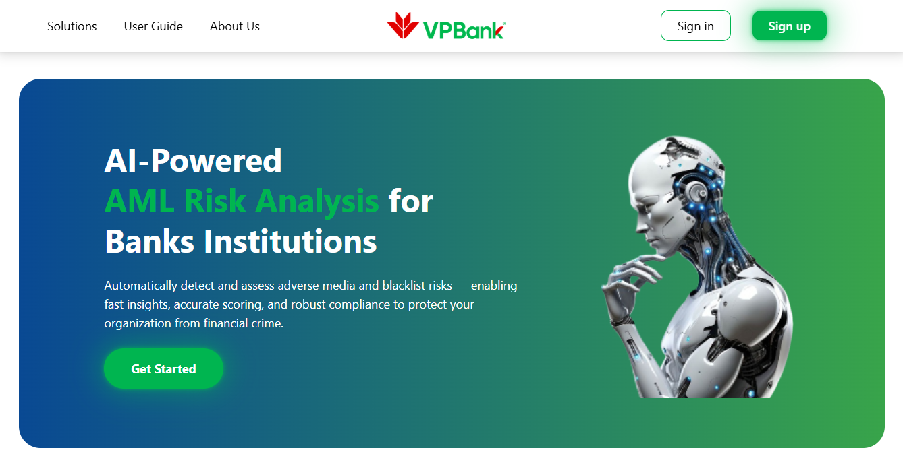

# VPBank Technology Hackathon 2025 - 253 CSUiter

We solved the task "Intelligent Risk Analyzer for AML Case Review", aiming to build an advanced system that automatically detects and assesses adverse media and blacklist risks — enabling fast insights, accurate scoring, and robust compliance to protect organizations from financial crime.

<br/>
<br/>



## File Tree

```
ChatUI/
├── public/                         # Static assets (favicon, images...) copied directly into build
│   ├── landingPage.png
│   └── vite.svg
|
├── src/                            # Application source code
│   ├── assets/                     # Project assets (images, icons)
│   ├── components/                 # Reusable UI components (header, navbar,...)
│   │   ├── Authentication/
│   │   ├── ChatBot/
│   │   ├── LandingPage/
│   │   ├── SearchMode/
│   │   │   ├── Chatbot/
│   │   │   ├── Text/
│   │   ├── ErrorHandler.jsx
│   │   └── Loading.jsx
│   ├── mocks/                      # Mock data for testing
│   ├── pages/                      # Main pages for routing
│   │   ├── ChatBot.jsx
│   │   ├── Form.jsx
│   │   ├── LandingPage.jsx
│   │   ├── SearchHome.jsx
│   │   └── Text.jsx
│   ├── App.jsx                     # Root component
│   ├── index.css                   # Global styles
│   └── main.jsx                    # Entry point to render <App />
|
├── README.md
├── eslint.config.js
├── index.html
├── package-lock.json
├── package.json
├── response.json
├── response_v2.json
├── response_v3.json
├── response_v4.json
└── vite.config.js
```

## How to run Our Vite + React Project

1. Install packages:

```bash
npm install
```

2. To run the project, use one of the following commands:

```bash
npm run dev
# or
yarn dev
```
